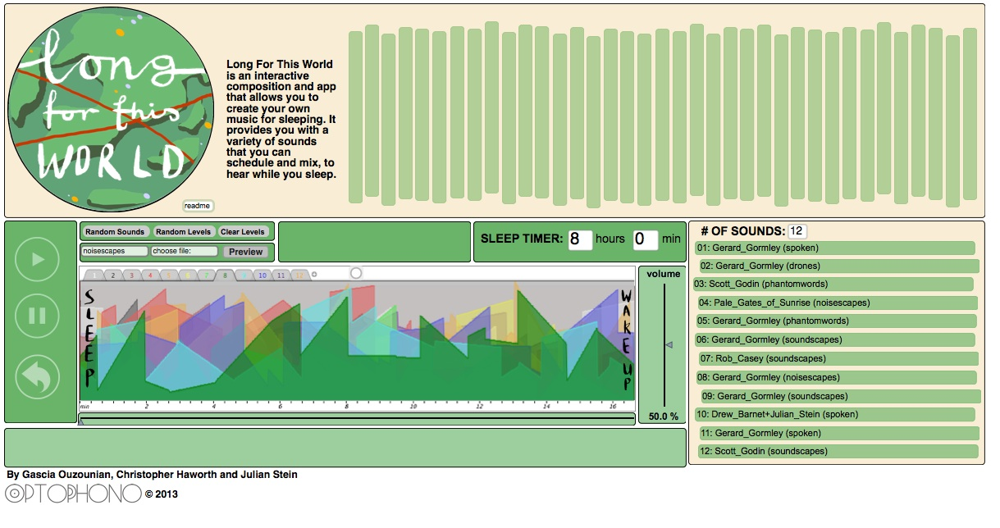

# Optophono

## Making Music Interactive

#### Prof Gascia Ouzounian, Dr Christopher Haworth, Dr Peter Bennett

As listeners we have come to think of recordings as something we passively consume. Music is something we press ‘Play’ on—and then do other things while the music ‘happens’. With Optophono we wanted to trouble this dynamic. We wanted to move away from the idea that recordings should be fixed or static objects, and that listeners should have so little creative input into the musical process. Therefore, instead of issuing fixed recordings on CD, tape or vinyl, we created interactive works that we published on hard drives and USBs. These compositions put the listener at the heart of the creative process. Instead of simply pressing ‘Play’ listeners could create their own music using our software and sounds. 

Some Optophono projects have practical applications in addition to being musical compositions. Long for this World, for example, doubles as a sleep app. Using our software, listeners can choose how long they want to sleep for—say, twenty minutes or eight hours—and then create their own music for sleeping. They can do this by mixing dozens of audio tracks contributed by various artists, choosing various randomizing functions, or selecting options from a bank of acoustic effects. The complexity and variety of the music that arises means that not only will every listener have an entirely different experience of the music upon each hearing, but that the listeners themselves will determine, to a large extent, what that music comprises. 

 

_Interface for Long for this World (2013) by Gascia Ouzounian, Christopher Haworth and Julian Stein. Photo credit: Optophono._

From this brief example we can already see that the concept of the musical work starts to break down. There is no fixed composition, and it’s unclear who the composer is, or whether there is a composer at all. Is the listener the composer? The software designers? The artists who contributed the audio tracks? Is this a collective composition? The usual categories of ‘composer’ and ‘listener’ simply do not apply.

In our project Music for Sleeping and Waking Minds (2010-12) we also questioned the idea of the musical performer. In this composition music is generated by four people who wear EEG sensors and simply go to sleep. As they sleep and awaken over the course of one night their brainwave activity generates an eight-channel audio composition and visual imagery. Audiences are invited to experience the work in various states of attention including sleep and dreaming[1](#fn1).

_Poster for Music for Sleeping and Waking Minds (2010-12) for sleeping performers and EEG sensors. Image credit: Stephen Maurice Graham._

Other Optophono projects have stemmed from notated scores but have evolved in interactive formats. For example in 2013 we released an interactive version of the British composer Cornelius Cardew’s seminal work The Great Learning (Paragraph 7). This work is scored for choir, and recordings normally consist of a single performance by a choir. For our edition, however, we released three versions of ‘Paragraph 7’, including a two-channel video version and an interactive, software-based version. With the software-based version listeners could select which voices in the choir they wanted to hear, position these voices in the stereo field, determine the volume of each voice, and so on. If we have the capability of allowing listeners to create their own versions of recordings—which we do—and if we are able to release multiple versions of the same work, then why don’t we do this? 

The music industry has to catch up to the digital age. We don’t believe the answer to this lies in digital streaming or other means of delivering static recordings to passive audiences. Listeners today are musically sophisticated. An average listener has probably heard more music by the age of ten than the world’s most celebrated composers would have heard over the course of their lifetimes a century ago. Why don’t we tap into this vast musical intelligence?

_Scanner module from Pyramid Synth (2017) by Pasquale Tortaro. Image credit: Pasquale Tortaro._

Music could more meaningfully come into dialogue with digital design, software design and object design. Some musicians and engineers are already thinking this way. Pasquale Tortaro, for example, has created a synthesizer that senses the properties of small objects—their colour, transparency, weight, texture, etc.—and modulates sound accordingly. Helena Hamilton, a visual artist and sound artist based in Belfast, is creating a new work for Optophono that will enable people to create their own music by drawing. 

Optophono would like to support the work of such artist-designers. At the V&A Digital Design Weekend we will also showcase work that we recently developed as part of our AHRC-funded project ‘Pet Sounds’, which explored the possibilities of music making using social media[2](#fn2).  More generally, with Optophono we would like to put pressure on the idea of what a music recording is. In the digital era recordings don’t have to be inert. Recordings can also be alive.

Optophono has been supported by AHRC Digital Transformations. 
For more on Optophono please visit www.optophono.com 

Dr Gascia Ouzounian is Associate Professor of Music at the University of Oxford. 
Dr Christopher Haworth is Lecturer in Music at the University of Birmingham.
Dr Peter Bennett is Research Associate in Computer Science at the University of Bristol.

**References:**

<ol>
<li id="fn1">See Ouzounian, G., Knapp, R.B., Lyon E. and DuBois, R.L. 2016. ‘To be inside someone else’s dream: _On Music for Sleeping & Waking Minds_’ in Alexander Jensenius (ed.), NIME Reader. New York: Springer, pp. 405-417.<a href="#fnref1">↩</a>
</li>
<li id="fn2">See Ouzounian, G., Haworth, C. and Bennett, P. Forthcoming 2017. ‘Speculative Designs: Towards a Social Music’. Proceedings of the 43rd International Computer Music Conference 2017. 16-20 October 2017, Shanghai, China.<a href="#fnref2">↩</a>
