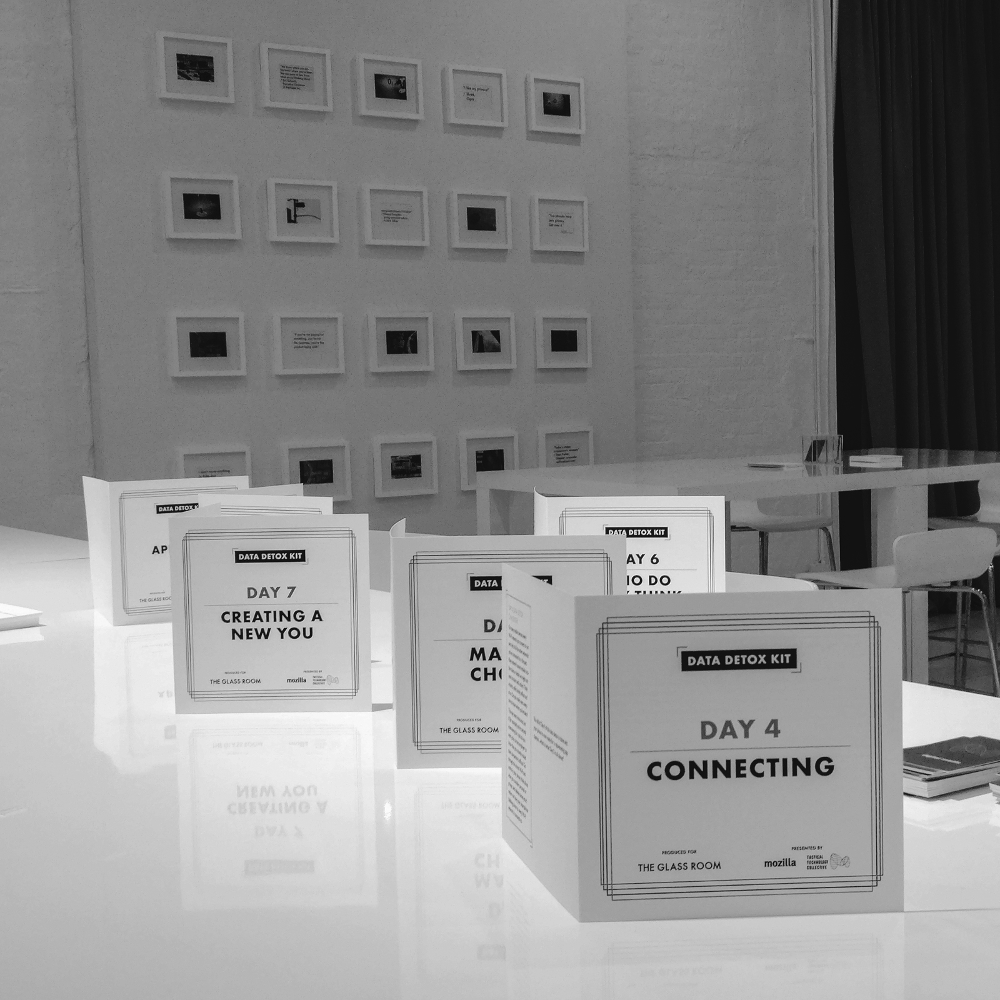

# Tactical Tech

_Image credit: TGRNYC Atmo Workshops, Nousha Salimi_

The Glass Room is a pop-up ‘tech store with a twist’ that disrupts how we consume technology and encourages users to make informed choices about their technology use. Set up initially in Berlin in 2016, and then later in New York, the Glass Room is intentionally designed to look like a slick, clean-lined tech and lifestyle store. On first glance, it seems to offer the latest in shiny digital consumer products, such as the newest tablet or fitness tracker. But as you go inside, you find there’s nothing for sale.  

Instead, as you look closer at the ‘products’ on display, you find that they are playfully and provocatively selected to turn the technologies we all use, on their head. The artworks and design pieces on display, invite you to take a look behind the screens and into the hidden world of what happens to your data. To reconsider whether or not you have ‘something to hide’, to ‘open the (black) box’ and see how your individual data looks from the outside and to reconsider how well you know the technologies you use every day. Despite first appearances, the Glass Room provides a very different consumer experience, one that allows visitors to re-evaluate how we use technology and how much we reveal about ourselves when we use it. 

_Image credit: Nousha Salimi_

Instead of corporate staff, you are met by a team of tech advisors with a different focus; ‘inGenious’ experts that are on hand to answer the questions raised by the exhibit, engage you in conversation and help you with alternatives, and privacy tips and tricks at the ‘Data Detox bar’.  Where you can take away a ‘Data Detox Kit’, an 8 day digital makeover – with a different topic covered every day, from browsing the web to using social media and from shopping online to using apps on your mobile phone.
In 2017, Tactical Tech, together with Mozilla developed a portable version of the Glass Room. This easy to assemble version, hosted in libraries, universities, arts spaces and community centres around the world, presents one of the key narratives from the original Glass-Room store. 

The portable exhibition seeks to both expose and demystify how the largest data companies in the world operate and what their relationship is with the individuals they simultaneously serve and rely on. ‘The Data Detox Bar’ which sits beside this, offers a self-learning and exploratory environment. One where visitors can map and measure their own data footprints and find out what kinds of ‘digital selves’ they create when they produce data as they go about their daily lives. The exhibition explores the co-dependency between the companies and the users and how this is changing our societies and our selves. It reminds us how we, as individuals and societies, increasingly can not live without our apps, platforms and online services, and on the other hand, how the data companies can not exist without us as individuals continuously producing the data that they endlessly collect, store, analyse and learn from – creating new centres of knowledge, wealth and power.  

 
_Image credit: Andrea Figari_

_Image credit: Alistair Alexander_

With the Glass Room and the Data Detox Kit, we want to introduce these issues to a wide audience, to make these questions and their answers accessible and even at times fun to explore. The project aims to foster a broader discussion on how data and technology is changing the personal, professional and social fabric of all our lives, creating an environment of reflection and a way of making informed choices in the future.

Curated by Stephanie Hankey and Marek Tuszynski, the Glass Room was originally conceived and produced in the context of the exhibition “Nervous Systems” with support by Haus der Kulturen der Welt.  The Glass Room project and Data Detox Kit is curated and made by Tactical Tech and presented by Mozilla. The portable Glass Room is made in collaboration with La Loma.

**_About Tactical Tech_** 
Tactical Tech is a Berlin-based organisation made up of activists, technologists and  designers who work at the intersection of technology, human rights and civil liberties. In an increasingly quantified society, Tactical Tech works internationally providing trainings, conducting research, and creating cultural interventions that contribute to the wider socio-political debate around digital security, privacy and the value and ethics of data.
tacticaltech.org, @info_activism 

**_About Mozilla_** 
Mozilla is the non-profit behind the popular web browser, Firefox. We believe the Internet is a global public resource, open and accessible to all. We work to ensure it stays open by building products, technologies and programs that put people in control of their online lives, and contribute to a healthier Internet.
mozilla.org, @mozilla 
