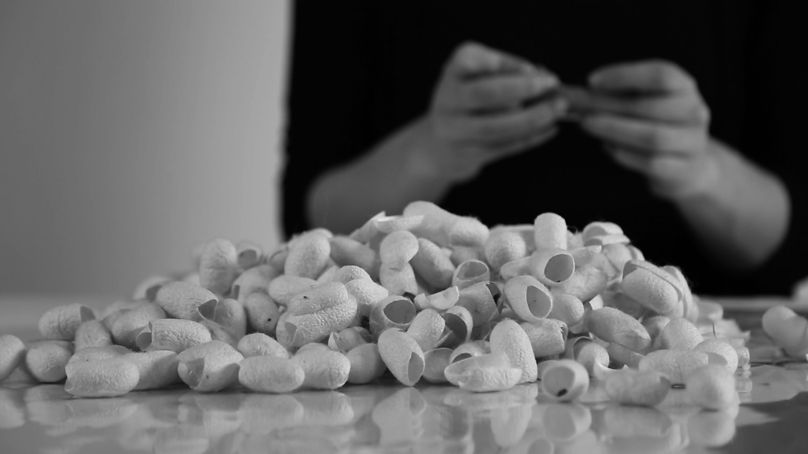

# Morphosis

#### Marlene Huissoud

Marlene Huissoud is challenging the properties of natural resources from the insects world. The piece presented at the V&A is composed by two materials from the honey bee, which produces a bio-degradable resin and from the Indian silkworm, which discards it’s hard cocoon when it reaches maturity:

Coming from a family of beekeepers, I am interested in the viability of utilising insects and their waste streams to create future craft artefacts. Already science is exploring the potential of insects for food production and to satisfy our future dietary needs, however, I am primarily interested in using insects as co-partners in the design process, rather than consume them I am interested in how we can work with them and explore how their natural waste streams could be harnessed in the production of valuable craft artefacts in the future. Initially, I am interested in two insects that we currently farm, the common honey bee, which produces propolis, a natural bio-degradable resin and the Indian silkworm, which discards it’s hard cocoon when it reaches maturity.

Morphosis is related to our living as one of the most important growing stage we will go through. The idea of morphosis is a matter of evolution, how a shape, material, human, insect will change with or without an external factor. 

The silkworm is one of the most iconic insect experiencing a morphosis during his entire evolution. He is born as a worm but then morph in a butterfly arrived at maturation. Within the silk industry most of the Bombyx Mori are killed in order to extract the silk from the cocoon, what if we let the worm become a butterfly?

How can we use this material differently and celebrate the morphosis of the insects? 
The piece has been made by an accumulation of thousands of silkworm’s cocoons and are then varnished with a thin layer of a natural honeybee bio resin. The slow process of the making of the piece underline the beauty of the insect world and defend a slow process in the making of those alien look pieces.

