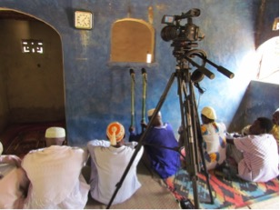

# Endangered languages go digital: a matter of urgency

#### Gemma Zamora & Mandana Seyfeddinipur

 

_Waiting for the Imam (recording of sermon_002). Koukouba 2011. Photo by F. Seidel._

Imagine for a second that the way you think and talk about your favourite topics, the way you joke or create poetry, the lullabies and prayers you grew up with or that particular word that embodies your system of values is on the verge of oblivion. And it is on the verge because there is no one who speaks your language. That is what happens when a language vanishes.

That is the reality millions of people around the world are facing and will be facing for the next century. Languages fall silent, speakers give up their languages because their ways of life are changing so fast. Globalisation, urbanisation and climate change are having a profound effect on peoples; to make sure that they and their children have a future they move to cities and they speak the language that gives them access to education and jobs. In many cases, they stop speaking their own language altogether.
The extinction of languages around the world advances at a rate equivalent to the loss of the 5th mass extinction of dinosaurs. We are losing our linguistic diversity at a dramatic speed, with little record of its depth and breadth. The Endangered Languages Documentation Programme tackles this reality by providing funding for research and a digital platform, the Endangered Languages Archive, for these languages and the people who speak them.
We strive to give visibility to these speakers and their languages and to ensure that their cultural heritage isn’t lost in the Information Age. What we are facing is a humanitarian crisis whose true extent cannot be grasped by listing simple facts and figures:

**_How many languages are spoken in the world today?_**

We estimate that there are between 6,000 and 7,000 languages spoken in the world today, and these are only the spoken languages, not including sign languages or whistled languages. The human capacity for language is our unique trait and sets us apart from all other species. Humans have developed this rich linguistic diversity and this is what we are losing today. They are vanishing without a trace because they do not have a writing system and they have never been recorded or described. What are we losing? We lose the knowledge about the ways of life, about our cosmologies, about how to make things and how to relate to each other. All of this is encoded in our languages in unique and specific ways, shaped over centuries of language use.

**_Who speaks all those languages?_**

Roughly speaking, 50% of the world’s population speak 50 languages, while the other half speaks the remaining 6,950 or so languages. Of course, these are just estimations, because languages are in fact very difficult to count. Sometimes they are used only in certain rituals, other times they hiding as a ‘dialect.’ This means there are languages that are spoken by 300 people and others that are spoken by 200,000 and these are all small languages.

**_Then, what exactly do you do?_**

We train linguists and speakers to create a digital record of their language as it is spoken today before it falls silent, before the last speaker dies. We give grants to go to places such as Papua New Guinea or to Brazil or to the USA to work with the remaining speakers and to record their knowledge. We preserve their recordings in our digital archive and make it available to speakers, researchers, artists and the public. For the future, we will have a record, in digital form, of human linguistic diversity as it is today.

**_How do you document a language?_**

You go and live with the community and  begin to learn from them about their ways of life and about how they say things. You record their conversations and their stories and their histories and everything they want to be preserved. Together, you and the speakers transcribe and translate the recordings and the linguist will analyse them and write a grammar. And often they compile a dictionary of the words of the language. For the children, they create story books and primers so they actually can teach the language to the children that do not speak the language anymore.

**_For example?_**

Between 2003 and 2016, ELDP has helped document 468 languages across 77 countries. These are just a few of them: Blablanga (Solomon Islands), Zorostrian Dari (Iran), Chimane (Bolivia), Ikaan (Nigeria), Tarahumara (Mexico), Tundra Nenets (Russia), Great Andamanese (India), Zaghawa (Sudan), Chulym (Russia), Sri Lanka Portuguese, Ju|'hoan (Namibia), Nkami (Ghana), Lakota (USA), Duoxu (China), Enets (Russia) and many more. Some of these languages are now extinct but, in other cases, the communities are working actively to reverse the process and keep passing the language on to younger generations.

**_And why are you exhibiting at the V&A?_**

When our fieldworkers come back after months of work, often in very remote areas and/or in politically and socially very difficult situations, they bring back an SD card. One SD card which contains the only record of a universe of knowledge encoded in an intricate system we call language. An SD card which contains the images of speakers who have never seen a computer or a webpage but whose grandchildren and great-grandchildren will be able to see their roots and their heritage in 20, 30 or 100 years. Our grantees spend months in the field, and when they come back and plug in their SD cards, a world view becomes part of our shared digital world, enriching and diversifying it with its unique take on the human condition.
