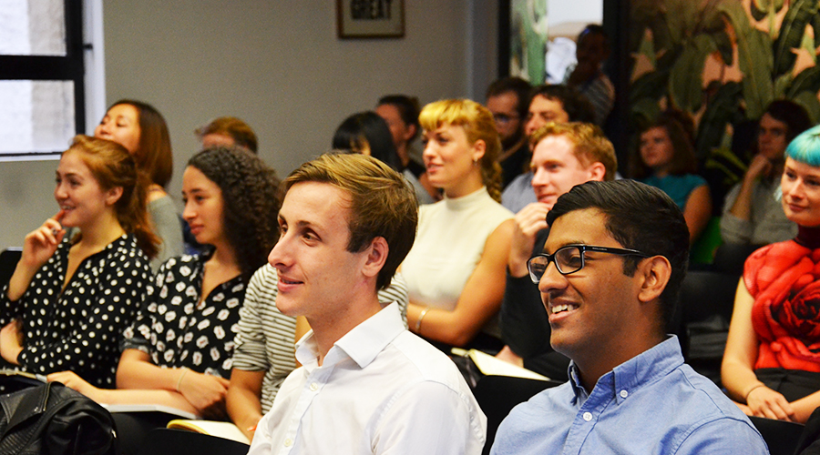
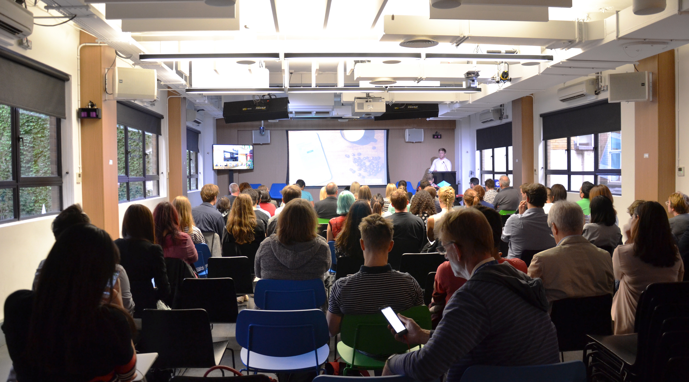

# Connecting People in the Arts

#### Samuel Fry

*Photographer: Sara Bianchetti*

The arts have always centred around communities of people. Whether those are art collectives, who share a common viewpoint, groups working together to run community art centres or even networks of artists who collaborate and inspire each other to create new work.

A couple of months ago, I spoke to Martin Franklin, who was the Digital Projects Manager at the London Philharmonic Orchestra at the time. We were discussing the arts and its relationship with technology when we began talking about collaboration.

Martin described his view, that “There is a long history of artists as catalysts, as hosts of events and as connectors of people.” Some people, Martin explained, would not consider these as artists in their own right; at best, they might think of them as curators. Yet, there is a creative skill in finding ways to connect people where you can see a mutual benefit.

Some would call those people “Connectors”. People that want to have a general awareness of current projects and programmes so that that can help the right people find them. Malcolm Gladwell describes Connectors as “the kinds of people who know everyone. All of us know someone like this. But I don’t think that we spend a lot of time thinking about the importance of these kinds of people.” [1](#fn1) Connectors are all around the arts world, bridging relationships between people.

For some time now, I have been interested in methods of connecting people in the arts. In many ways, the world is becoming better connected; however, the rise of the internet, social networks and online communities has also lead to the creation of multiple groups with similar purposes. The challenge is making sense of these groups. 

Right now, for instance, across the UK there are many community work spaces for artists. Some of these call themselves studios, others incubators and some just a space. Each has its own purpose and brings together artists working in similar fields, or geographies. These communities are incredibly powerful as artists share knowledge with each other and often collaborate on work together.

Cockpit Arts [2](#fn2), for instance, is a fantastic business incubator for designer-makers in London, offering studio space and business support. Elsewhere, the Pervasive Media Studio [3](#fn3) at Bristol’s Watershed provides a space for a community of artists, creative companies, technologists and academics that are exploring experience design and creative technology. Somerset House have now opened their own studios [4](#fn4), to support artists and makers that are engaging with urgent issues and pioneering technologies. The list goes on.

Yet, how do artists, curators, experimenters, collectors and fans of the arts find these communities? Do we need to rely on word of mouth, or even a quick Google?

As the world progresses from a technological standpoint, the arts need to progress with it and find the best ways to collaborate and share work. Some of these methods might remain physical but often these will be digital. What is more, the arts need to find ways to be at the forefront of technological experimentation – not just to be seen as a follower of trends, or as a place where technology is used merely as a gimmick.

This is happening already and it is happening in various places. My ask of you, is that you help share it.

*Photographer: Sara Bianchetti*

**References:**

<ol>
<li id="fn1">“Are you a Connector?”, June 21st, 2013, MALCOLM GLADWELL. (http://gladwell.com/are-you-a-connector/) <a href="#fnref1">↩</a>
<li id="fn2">www.cockpitarts.com <a href="#fnref2">↩</a>
<li id="fn3">www.watershed.co.uk/studio/ <a href="#fnref3">↩</a>
<li id="fn4"> https://www.somersethouse.org.uk/somerset-house-studios <a href="#fnref4">↩</a>
</li>
