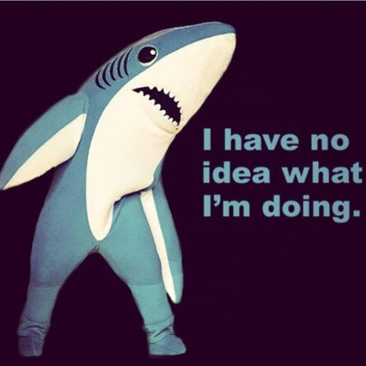

This was originally published at Imperica: https://protect-eu.mimecast.com/s/KnEnBIqxl7iR

# Copyright, culture, and creativity

#### Antonio Roberts

I am child of the mid-eighties - born in the last year of being a Digital Native but somehow still a Millenial - so the punk, lo-fi indie, grunge and all other "underground" movements of the 90s and earlier largely passed me by the first time around. These movements were celebrated for going against the mainstream, led by visionaries who would, the media proclaimed, eventually give us the tools for free thought and bring an end to bland pop culture.

But a strange thing happened. They were absorbed by the mainstream media and what they had achieved - an aesthetic, a music genre, a fashion - was sold back to us at a premium as a way for us to buy into the culture. Take, for example, urban culture. In her 1999 book No Logo Naomi Klein highlights how brands would "search out pockets of cutting-edge lifestyle, capture them on videotape and return to clients like Reebok, Absolut Vodka and Levi".

Over the past decade, young black men in American inner cities have been the market most aggressively mined by the brandmasters as a source of borrowed "meaning" and identity. This was the key to the success of Nike and Tommy Hilfiger, both of which were catapulted to brand superstardom in no small part by poor kids who incorporated Nike and Hilfiger into hip-hop style at the very moment when rap was being thrust into the expanding youth-culture limelight by MTV and Vibe (the first mass-market hip-hop magazine, founded in 1992). "The hip-hop nation," write Lopiano-Misdom and De Luca in Street Trends, is "the first to embrace a designer or a major label, they make that label 'big concept' fashion. Or, in their words, they 'blow it up.'"

Which is why the cool hunters' first stop was the basketball courts of America's poorest neighbourhoods.

As we have seen since hip hop came into the public eye since the 1980s, this urban culture has been appropriated and sold back to us at a premium, directly targeting the poor neightbourhoods from where it came. But who from these poor neighbourhood estates can readily afford to buy back the culture they created at such a premium?

This trend of cool hunting is still with us now but in a somewhat accelerated way. Niche communities, which in pre internet days may have a handful of members, are now connected in large numbers over geographically diverse locations. Look for any interest and you can find a vibrant internet community surrounding it. Sites like 4chan, Tumblr, Reddit, Twitter are full of people celebrating their niche interests over hashtags, forums, and tweets. These sites can act as fertile ground for brand developers to go about their cool hunting with little effort. They don't need to send people out to physical locations to film people going about their activities. They can simply browse a website, observe communications between its users, build statistics on its activities and assess whether what they are doing is worthy of being a target to extract from.

Such a community target by the cool hunters may feel the positive effects of this - a feature on Vice, increased activity, financial investment etc. But the effects of this can be detrimental to the community and its identity. Take, for example the case of Rihanna and her brief foray into Seapunk aesthetics. In 2012 she performed her song Diamonds live against a green screen on Saturday Night Live. What we saw on our screens were the lo-fi "net" aesthetics of Seapunk that could have easily been lifted from the many Tumblrs of prominent Seapunk artists and musicians.

Seapunk, for the uninitiated, is, according to the ever reliable Wikipedia(<https://en.wikipedia.org/wiki/Seapunk>):
 
_is a subculture that originated on Tumblr in 2011. It is often associated with an aquatic-themed style of fashion, 3D net art, iconography, and allusions to popular culture of the 1990s._
 

Spend five minutes on the Seapunk Tumblr tag (<https://www.tumblr.com/search/seapunk>)and you'll have enough information to understand its appeal. Whilst it's true that no one person or community can lay claim to an idea or aesthetic, to many it felt like this was an appropriation and exploitation of an aesthetic that they helped create. Worse still, there was no reference to the culture from where it came and no involvement from the community. This was the internet equivalent to the cool hunters scouring the streets of America's poorest neighbourhoods.

This is by no means the only instance of this corporate appropriation of niche "underground" internet cultures. Brands Saying Bae, a now-defunct Twitter account, would document these cringeworthy attempts at using internet culture to relate to its customers and, as always, sell more products. From a marketing standpoint it's not hard to understand why this approach would be taken. Memes are a widely used method for people of all ages to quickly communicate an idea.

The rational amongst us note that really no one person can dictate how a popular idea is used. Once an idea is it there it's up for the taking. Nick Briz, in response to the Rihannah performance and inspired by Touch My Body by Oliver Laric, started the Diamonds ( Green Screen Version) project.  He re green-screen a section of the performance and gifted it back to the internet with the intention that they remix it and add their own aesthetic.

However, Nick Briz, quoting Jacob Ciocci, reiterates the rational argument of cultural appropriation being inevitable:
 
But to claim that we, all of us, are not a part of this mutation process ourselves is the kind of lie that is unproductive, different than the creative, productive lie I mentioned before. We have to embrace mutation in all it's forms if we embrace it at all. From net kids giving new meaning to the emptiness of commercial space, to art directors getting it wrong but thus getting it right. This is an exciting cycle that is also painful, like life.
 
For the most part this idea of culture being cyclical is rational. Whilst it would have been commendable for Rihanna's art directors to acknowledge and thank the Seapunk community that it borrowed from, Seapunk in itself borrows from early 90s aesthetics and even early-day MTV. However, where I feel Ciocci's argument falls short is that it does not necessarily take into the account the uneven distribution of power in these incidents. For this we need to briefly look at Copyright.

Copyright is, very broadly speaking, the right for a piece of artwork to be copied. The law varies in different territories, but it is something that is automatic granted to an artist upon creating their artwork (no © required). For it to be deemed an artwork it requires that it be in a fixed tangible medium (file, video, paper etc) for more than transitory period i.e. not fleeting and somewhat reproducible, and use a modicum of creativity. So, no, you can't copyright a dot on a page! You also can't copyright an idea just an expression of that idea. So, the idea of Seapunk can't be copyrighted, but a Seapunk artwork can.

I can talk confidently about what I know about Copyright - as a result of supporting the Free Culture and Open Source movements for nearly 10 years and undertaking the CopyrightX course in 2015 I have done extensive research and reading. However, what I know is still very very little. Copyright is a highly complex subjective law where everything is up for debate. Where one artist can claim that an artwork is merely inspired by another, another can claim that their work is plagiarism (see Tuymans vs Van Giel). Beginning to understand copyright on even a basic level can be a career in itself and take years of study. Just as no users of technology read the terms of service, no artist spends their time studying the Statute of Anne in order to understand Copyright. And why should they? We're in the business of creating art, not law.

It is this naivety and lack of understanding which corporations, with their teams of copyright lawyers, can exploit in order to push the boundaries of what is acceptable. Artists, which includes anyone creating anything (yes, even a tweet is your work of art), do not have the luxury of being able to call upon the advice of expensive legal teams every time they create an artwork.

One such example of this exploitation is Left Shark. This high profile case centers around a meme born out of Katy Perry's performance at the 2015 Superbowl. The performance featured Perry performing with dancers in costumes, including two sharks positioned either side of her. Viewers noticed that the shark on the left appeared out of sync with the other one, appearing even slightly drunk. The internet loved this and quickly Left Shark was born, with the memes appearing almost immediately.

One internet user, Fernando Sosa, took it upon himself to create a 3D-printable model of the shark and upload it to Shapeways, a popular site for hosting 3D models. Perry's lawyers shortly afterwards sent a cease-and-desist letter and ordered that the model be taken down citing that they owned the image of Left Shark. This preposterous claim was fought against, with the file going back online. In a even more ridiculous move Perry's lawyers then tried to trademark "Left Shark" and also Right Shark, Drunk Shark and Basking Shark. This attempt, which was thankfully unsuccessful, is dangerous as is it an attempt at owning an idea and expression of an idea that was not created by them. This is different from Nike going into the poorest areas of America to create a brand that is symbolically synonymous with urban culture. This would have legally allowed them to own everything.

Thankfully the high profile of this case was enough to get involvement from lawyers and funds to support a legal challenge. But this will not always be the case? Cultural production might be the cyclical processes of artists borrowing from popular culture and corporations, remixing it, producing new artworks, only to then go on to be borrowed from by corporations, but without expensive highly skilled lawyers who will intervene when our creative process is under threat can we be reassured that we won't be exploited?

Originally published at Imperica. © 2017 Perini

