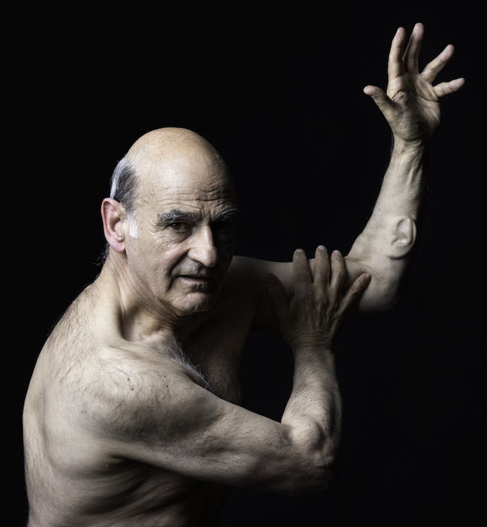
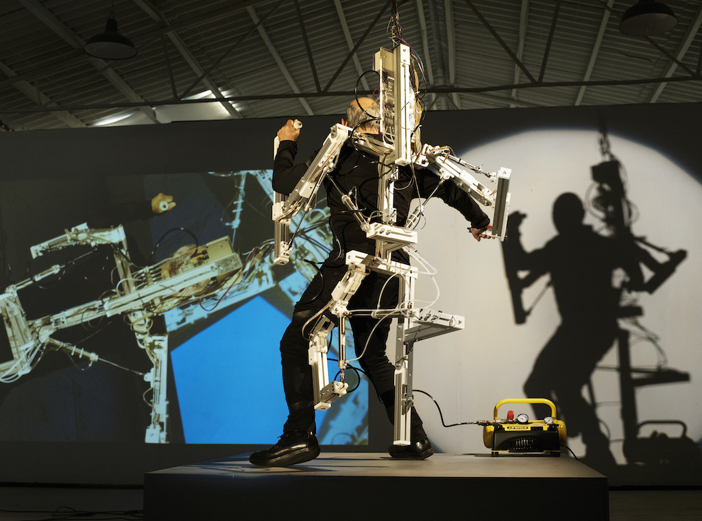

All rights reserved to the author of this contribution.

# INADEQUATE / AMBIVALENT / INDIFFERENT – COMPLICIT AND CONTESTABLE BODIES.

#### Stelarc

**_CIRCULATING FLESH / NEITHER BIRTH NOR DEATH_**

_Ear On Arm, Venice International Performance Art Week, 2016: Photographer- Piero Viti (Stelarc)_

We live in an age of circulating flesh. Body fluids and body parts have been preserved and are accessible. Organs can be extracted from dead bodies and inserted into living ones. Hands can be transplanted and reanimated. The face from the donor body, stitched to the recipient skull becomes a third face, resembling neither. Stem cells replicated in-vitro are re-injected and repair tissue in-vivo. Stem cells can become skin and muscle cells. In fact, any cell. A skin cell from an impotent male can be re-engineered into a sperm cell. More interestingly a skin cell from a female can be recoded into a sperm cell. Wombs from a deceased donor that would last the full term of a pregnancy will soon be able to be implanted into a patient.  And further, if a fetus can be sustained in an artificial and external womb, then a body’s life would not begin with birth – nor necessarily end in death, given the replacement of the malfunctioning parts. Birth and death, the evolutionary means for shuffling genetic material to create diversity in our species and for population control, will no longer be the bounding of our existence. Our analogue development, deterioration and death is unnecessary.

**_THE CADAVER, THE COMATOSE  & THE CRYOGENIC_**

We can preserve a cadaver indefinitely with plastination while we can simultaneously sustain a comatose body on life-support systems. Dead bodies need not decompose, and near dead bodies need not die. The brain-dead have beating hearts. The right to die becomes as important as the right to live. To live is often the result of being connected to instruments and machines. Death now for many means that which happens when the body is disconnected from its technological life-support systems. The dead, the near-dead, the not yet born and the partially living exist simultaneously. And cryogenically preserved bodies await reanimation at some imagined future. We engineer chimeras in the lab, transgenic entities of human, animal and plant genes. And as parts of bodies are replicated artificially, as we can 3D print organs and when we can stem cell engineer organs, there will be an excess of organs, of organs awaiting bodies, of Organs Without Bodies. 

_StickMan, Daedalus Project, Chrissie Parrot Arts, Fringe World, Perth 2017: Photographer- Toni Wilkinson (Stelarc)_

**_SMART BOMBS / DUMB BODIES_**

Autonomous, interactive and increasingly intelligent technologies perform with exacting precision and lethal power. And with a speed that far exceeds our metabolic and muscular capabilities. Computational systems calculate immense and complex data. Machines are generally more robust and reliable than the soft, vulnerable and fatigue-ridden bodies. It’s apparent that as our machines are becoming more sophisticated they expose our bodies not only as defective, but also dumb. In fact, as technology becomes more connected it becomes more collaborative and consequently more intelligent. The body as a consequence becomes increasingly pacified and more powerless to compete and can only become complicit with these extended and amplified operational systems.  The ballistics of the body to determine its trajectory, position/orientation and velocity are the ballistics of its technology. The body’s sensory and cognitive capabilities are hard-wired to its instruments and computational systems. Bodies become end-effectors for other bodies in other places and for machines elsewhere, generating interactive loops and recursive choreographies. Fractal Flesh proliferates, Phantom Flesh soon becomes potent.

**_SKINS / SELVES / EXTRUSION_**

As soft and unstable bodies we are increasingly operating in spaces of extended scale and abstract information, beyond subjective experience. We caress our skin, our heart beats persistently, we inflate our lungs with air incessantly and we erratically glance at others. But the body now experiences itself as part physical, part phantom; grounded by gravity but dislocated from any one particular place. To others elsewhere, we increasingly flicker on and off, connecting and disconnecting, appearing here and there, as phantom bodies - as glitches in biological time. Skins collapse onto screens, becoming seductive and interactive surfaces. Skins are stretched, selves are extruded. Electronic surfaces that have both optical and haptic thickness. Images generate vocabularies of aliveness that animate our phantoms. Our bodies are now dissolving into circulating data streams of detached and distributed bio-data. Embedded in vast machine systems of artificial cognition and computational calculation. The monster is no longer the outmoded stitched up meat body, but the system that sucks the self into virtuality. In the liminal spaces of proliferating Prosthetic Bodies, Partial Life and Artificial Life, the body has become a floating signifier. 

_ReWired / ReMixed: Event for Dismembered Body, Radical Ecologies, Perth Institute of Contemporary Art, Perth, 2016: Photographer- Steven Aaron Hughes (Stelarc)_

**_MIXED, AUGMENTED & REMOTE REALITIES_**

We now navigate from physical nano-scales to virtual non-places. And we are increasingly expected to perform in Mixed and Augmented Realities. To operate effectively we need to seamlessly slide between the actual, the instrumental and the virtual. We are rewired physically, re-located to remote spaces and have become mere disembodied, mobile eyes and a circulating cacophony of whispers. Although still primarily biological bodies we are now accelerated by our machines, extended by our instruments and we increasingly have to manage data streams in virtual systems. So the body becomes this contemporary chimera of Meat, Metal and Code. The body is neither all here nor all there. But partly here (as this body) and partly elsewhere (as other bodies). Sometimes and at other times. It performs beyond the boundary of its skin and beyond the local space that it inhabits. Being a single agent, located in only one place, performing purely as a biological body is an outmoded and inadequate existence. A body now has multiple agency. It is simultaneously a possessed and performing body prompted not only by people in other places but by internet data streams. Bodies are animated not only by social and cultural imperatives but also by telematic promptings. The schizoid body becomes a Split Body (not a split mind / body but a split physical body). Bodies will become portals for people in other places. Imagine being in Perth and being immersed in online, real-time streaming media – scanning sites in London, whilst acoustically listening in to voices in Los Angeles, whilst someone else in Tokyo is possessing and performing a action with your left arm, prompting you to collaborate and complete the task with your right arm. 

**_ALTERNATE ANATOMICAL ARCHITECTURES_**

It is an evolutionary imperative to engineer alternate anatomical architectures. The artist has performed with a Third Hand, a Virtual Body, an Extended arm, and Exoskeleton (a 6-legged walking machine). With the Propel: Body on Robot Arm performance, the body’s trajectory, position / orientation and velocity was choreographed by a large industrial robot arm.  The Ear on Arm project is to surgically construct and cell-grow an ear on the forearm. Then to electronically augment it to become internet enabled. A bodily structure has been replicated, relocated and will be re-wired for additional capabilities. Having evolved with soft internal organs to better function biologically, we can now engineer additional external organs to better interface and operate in the technological terrain and media landscape that we now inhabit. Everyone will be in at least two places at once. Interchangeably as a physical body in one place and a phantom body elsewhere. In the Re-Wired / Re-Mixed performance (For Radical Ecologies, Perth Institute of Contemporary Art, 2016) the artist in Perth could only see with the eyes of someone in London, could only hear with the ears of someone in NY, whilst anyone, anywhere could access his 6 degree-of-freedom exoskeleton and choreograph the movements of his right arm. His vision was disconnected from his hearing and his arm was disconnected from his agency. The body performed for five days, six hours a day continuously. A distraught and distributed body whose senses and a limb were outsourced to others everywhere. And imagine a synesthesia not through the cross-wiring in one body but a synesthesia experienced through the cross-wiring of senses from other bodies elsewhere. 

_Propel: Body on Robot Arm, DeMonstrable, Autronics / Lawrence Wilson Gallery, Perth 2015: Photographer- Steven Aaron Hughes (Stelarc)_

**_CONTESTABLE FUTURES_**

It is no longer meaningful to imagine having a mind of your own, nor any mind at all in the traditional metaphysical sense. The traumatized body inhabits proliferating spaces of anxiety and ambivalence and needs to remain indifferent, open to possibilities. What it means to be human is perhaps not to remain human at all. The pathological and the perverse become the poetic promise of the chimera. The artist can do no better than initiate aesthetic actions – but ones that transgress, disrupt and generate alternate possibilities. A transition from psycho-body to cyber-system becomes necessary to function effectively and intuitively with forward masking in remote spaces, speeded-up situations and complex interacting architectures. Can a body cope with experiences of extreme absence and alien action without being overcome by outmoded metaphysical fears and obsessions of individuality and free agency? A body would thus need to experience its actuality neither all-present-in this-body, nor all-present-in-that-body, but partly-here and projected-partly-there. This generates a radical emptiness, not through lack but rather through an excess of its hyperlinks. An extrusion of its subjectivity. As bodies, our awareness and operation is now extended, interacting and operating with other bodies and machine end-effectors. The body acts with indifference. Indifference as opposed to expectation. An indifference that allows something other to occur, that allows an unfolding – in its own time and with its own rhythm. An indifference that allows the body to experience the uncanny and the alien.  A body that films its internal body spaces, a body that endues being suspended with hooks into its skin, that allows an insertion of a sculpture into its stomach and whose arm gestures animate a 6-legged robot.  And a body that allows an ear to be surgically constructed and internet enabled on its arm. Alter the architecture of the body and you adjust its operation and awareness. The body is no longer merely an object of desire, but rather an object that requires redesigning. 

**BRIEF BIOGRAPHICAL NOTES**

Stelarc explores alternate anatomical architectures, interrogating issues of agency, identity and the posthuman. He has performed with a Third Hand, a Stomach Sculpture and Exoskeleton, a 6-legged walking robot.  Fractal Flesh, Ping Body and Parasite are internet performances that explore remote and involuntary choreography. He is surgically constructing and stem-cell growing an ear on his arm that will be internet enabled. In 1996 he was made an Honorary Professor of Art and Robotics at Carnegie Mellon University, Pittsburgh and in 2002 was awarded an Honorary Doctorate of Laws by Monash University, Melbourne. In 2010 was awarded the Ars Electronica Hybrid Arts Prize. In 2015 he received the inaugural Australia Council’s Emerging and Experimental Arts Award. In 2016 he was awarded an Honorary Doctorate from the Ionian University, Corfu. Stelarc is currently a Distinguished Research Fellow, School of Design and Art, Curtin University. His artwork is represented by Scott Livesey Galleries, Melbourne. 
